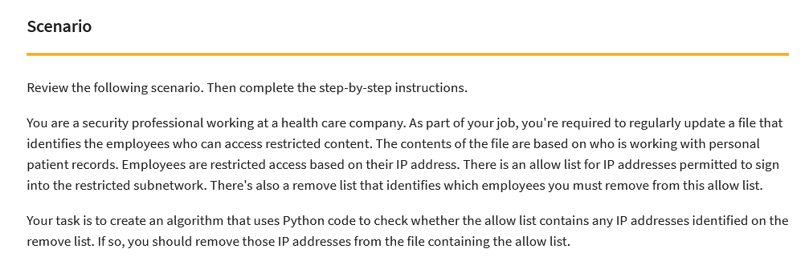

# Google-Cert-Developing-Python-Alghorithm
A project made in Google Cybersecurity Certificate to develop my skills in Python.

I was given following scenario:

Everything is described in "Developing an alghorithm.pdf" file. My code includes converting txt file to string to be read, and then converting this string to a list and many more.
